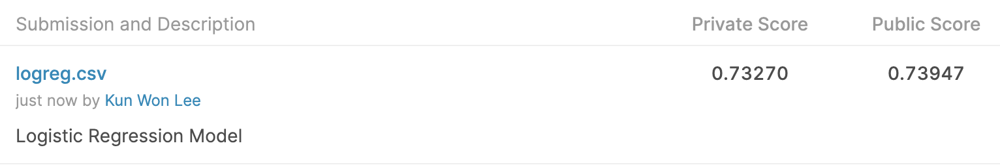

# Prediction Model for the West Nile Virus in Chicago 

### Objective of WNV Prediction Model 
The [West Nile Virus](https://www.cdc.gov/westnile/) is the leading cause of mosquito-borne disease in the continental United States, and is mostly spread to people by the bite of an infected mosquito. While most people infected with the West Nile Virus do not feel sick, about 1 in 150 infected people develop a serious, and sometimes fatal illness. As there are no vaccines or medications to treat the West Nile Virus in people, it is of importance for the city of Chicago to put into place measures for reducing the number of mosquitoes in the city, and in turn reducing the probability of the West Nile Virus being transmitted to humans.

Hence, the Chicago Department of Public Health (CDPH) has engaged us, GA Data Solutions, to come up with a data-driven method to accurately predict the outbreaks of the West Nile Virus across the city of Chicago, and allow them to more efficiently and effectively allocate resources towards preventing transmission of this potentially deadly virus.

### Project Description
This project is divided into three notebooks:-

1. Data Cleaning
- Dropping/imputing missing data values
- Converting data types

2. EDA
- Examining the presence of the West Nile Virus with respect to the time period, aerial sprays and weather conditions
- Feature Engineering 

3. Pre-processing and Modelling
- Logistic Regression, Random Forest, Gradient Boost Classifier, XGBoost Classifier
- Evaluation based on Sensitivity score
- Predictions from test.csv will be entered into the [Kaggle competition](https://www.kaggle.com/c/predict-west-nile-virus ), which will be evaluated based on the ROC AUC scores.

### Data Dictionary

`train.csv`, `test.csv` - the training and test set of the main dataset. The training set consists of data from 2007, 2009, 2011, and 2013, while the test set will require us to predict the presence of West Nile Virus for 2008, 2010, 2012, and 2014.

- `Id`: the id of the record
- `Date`: date that the WNV test is performed
- `Address`: approximate address of the location of trap. This is used to send to the GeoCoder. 
- `Species`: the species of mosquitos
- `Block`: block number of address
- `Street`: street name
- `Trap`: Id of the trap
- `AddressNumberAndStreet`: approximate address returned from GeoCoder
- `Latitude, Longitude`: Latitude and Longitude returned from GeoCoder
- `AddressAccuracy`: accuracy returned from GeoCoder
- `NumMosquitos`: number of mosquitoes caught in this trap
- `WnvPresent`: whether West Nile Virus was present in these mosquitos. 1 means WNV is present, and 0 means not present. 

`spray.csv` - GIS data of spraying efforts in 2011 and 2013

- `Date`, `Time`: the date and time of the spray
- `Latitude`, `Longitude`: the Latitude and Longitude of the spray

`weather.csv` - weather data from 2007 to 2014. Column descriptions in noaa_weather_qclcd_documentation.pdf 

#### Methods Used
Kmeans, Standard Scaler, SMOTE, Logistic Regression, Random Forest, XGBClassifier, GridSearchCV
#### Tools
Python using Numpy, Pandas, Matplotlib, Seaborn, Kmeans, Standard Scaler, SMOTE, Logistic Regression, Random Forest, XGBClassifier, GridSearchCV
#### Needs of Project
Data Cleaning, EDA, Data Visualization, Modelling Techniques, Interpretation of Results to Non-Technical Audience

### Executive Summary of Model Scores
|Model|Training AUC Score|Testing AUC Score|Accuracy|Sensitivity|Specificity|Precision|F1 Score|
|---|---|---|---|---|---|---|---|
|Dummy|0.500|0.500|0.946|0.000|1.000|0.000|0.000|
|Gradient Boost|0.961|0.829|0.785|0.711|0.790|0.161|0.263|
|Random Forest|0.983|0.836|0.829|0.570|0.844|0.172|0.264|
|Logistic Regression|0.901|0.839|0.756|0.754|0.756|0.149|0.249|
|XGB Classifier|0.998|0.843|0.800|0.675|0.807|0.166|0.266|

The model did modestly well in the Kaggle competition, placing 517th out of 1304 participants.

### Conclusions
- Some key contributing factors that leads to the West Nile Virus Outbreak:
    1. Seasonality as driven by the types of weather phenomenon.
    2. The pressence of particular mosquito species namely culex pipiens and culex restuans.
    3. The location classified in clusters.
- The backtesting demostrates the predictive model built does better than the baseline when using these key variables.
- Based from the economic cost benefit analysis, it is observed that the the economic benefits would outweigh the costs from spraying even if not all cases are prevented.
- It is also observed that spraying insecticides in Chicago is currently more reactive than proactive, in response to already known outbreaks.

Cost-benefit analysis sources: 
https://www.ncbi.nlm.nih.gov/pmc/articles/PMC3322011/ for data on cost-benefit analysis of West Nile Virus in Sacramento.
https://www.chicago.gov/content/dam/city/depts/cdph/food_env/general/West_Nile_Virus/WNV_2018databrief_FINALJan102019.pdf for Chicago data

### Recommendations for the WNV Prediction Model 
- Logistic Regression will be the most suitable model for this WNV prediction model classifier based on the sensitivity score at 0.754.  
- We recommend that the CDPH should build a predictive model encompassing the usage of lagged weather, traps and location data. This will then allow the model to pinpoint which locations should be sprayed in order to better combat the virus outbreak.

